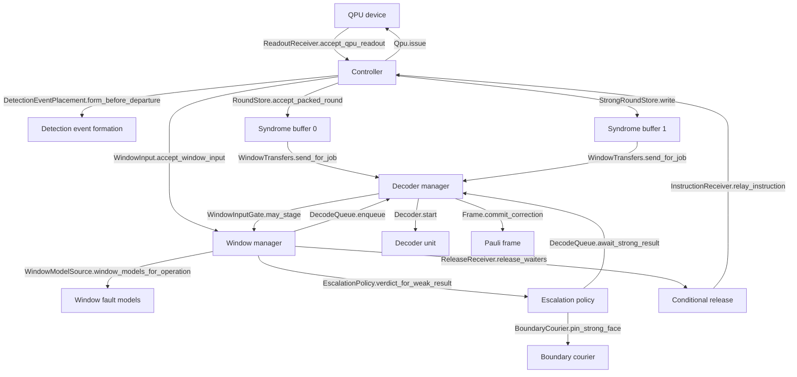

# Architecture

decsim is one root and a row of components, in the order a readout
travels. Each component depends on the port of the next, never on its
class, so a component can be replaced without any other one knowing.
`decsim/ports.py` is that list of ports, top to bottom in pipeline order,
with the record that crosses each; `decsim/machine.py` wires them in the
same order, calling the builders of `decsim/build/` the way gem5's config
script assigns ports.

## The readout's path

The `%%` lines are mermaid comments, and they say which package each
node is: `tests/test_docs.py` reads them, checks that the port on every
arrow declares that method in `decsim/ports.py`, and walks the package
at the arrow's tail to find the call. An arrow nobody makes fails the
suite.

Each arrow is one port method, and the component at its tail is the one
that makes the call. The decoder manager stages a window's rounds out of
a buffer into a unit's input slot, and starts the unit when the window
side's own gate allows it.

Every arrow between two components also rides a link card
(`Link.send`, `decsim/links/`), which charges the hop its serialization
and propagation and books it under one path name. The path names are the
`LinkPath` values in `decsim/records/transfers.py`; the traffic ledger
reports one row per path.

## What each component owns

| Component | Package | It is handed | It hands on |
| --- | --- | --- | --- |
| QPU device | `qpu/` | one operation body per patch | one readout per round, on the cycle boundary |
| Controller | `controller/` | readouts | one packed round per round, with its detection events formed when the `controller` row of `DETECTION_EVENT_FORMATION` is chosen, and raw when the `decoder` row is |
| Syndrome buffer 0 | `syndrome_buffer/` | packed rounds | the rounds a window reads, kept until every hold releases |
| Syndrome buffer 1 | `syndrome_buffer/` | the same packed rounds, in parallel | the rounds a strong window reads |
| Window manager | `windows/` | published rounds | one decode job per closed window, and each window's boundary to the next |
| Detector error model | `detector_error_model/` | the circuit's whole-circuit model | one fault model per window |
| Decoder manager | `decoders/` | decode jobs | one result per request, after its input landed and its unit computed |
| Decoder unit | `decoders/` | one input per slot | the correction its backend found, priced at the unit's clock |
| Escalation | `escalation/` | a weak result and its confidence | the verdict: keep it, or redecode the region on the strong tier |
| Pauli frame | `pauli_frame/` | one correction per window | the folded frame per stream, and the release of what waited |
| Observation | `observe/` | callbacks every component fires | the metrics, the traffic ledger, the trace |

Seventeen pluggable parts are picked by a table, the link fabric and the
threshold source among them. Each part has its port in `decsim/ports.py`
and one table of rows in the package that owns it;
`docs/reference/tables.md` lists all seventeen with their rows. A port
is a `typing.Protocol`, which is structural: a class fills it by having
the methods, and inherits nothing.

## The hops, one row each

A hop is one pair of neighbours and one link path. The traffic ledger
books every transfer as one of three words
(`decsim/observe/data_movement.py`): a move leaves the bits behind, a
copy ends with both sides holding them, and a reference hands over an
object both sides read, which is what a store's hold books rather
than a hop of its own.

| Hop | Path | Bits |
| --- | --- | --- |
| Readout electronics to controller | `qpu_to_controller` | move, one bit per measure qubit per round, and on the last round the data readout too, one bit per data qubit |
| Controller to syndrome buffer 0 | `controller_to_weak_buffer` | move, the packed round |
| Controller to syndrome buffer 1 | `controller_to_strong_buffer` | copy, the same round in parallel |
| Buffer 0 to a weak unit's input slot | `weak_buffer_to_weak_decoder` | copy, the window's rounds |
| Weak decoder to strong decoder | `weak_decoder_to_strong_decoder` | the selection only, no payload |
| Buffer 1 to the strong decoder | `strong_buffer_to_strong_decoder` | copy, the strong region at once |
| Decoder to decoder | `decoder_to_decoder` | the committed window boundary |
| Weak or strong decoder to the frame | `weak_decoder_to_frame`, `strong_decoder_to_frame` | one bit per logical observable |
| Frame to controller | `frame_to_controller` | the release, no payload |
| Controller to the QPU | `controller_to_qpu` | the instruction, no payload |

The hardware each hop stands for is named in the module that models it:
readout over a low-latency link and syndrome formation at the controller
(Google, arXiv:2408.13687), the streamed buffer the decoder reads, the
strong decoder's stored region and its two-sided boundary condition
(Toshio, arXiv:2510.25222), and the conditional pulse back to the QPU
(Yang, arXiv:2605.04892).

## Time

One `Engine` (`decsim/engine.py`) orders every action by integer ticks;
one microsecond is a million ticks. A component never sleeps and never
polls: it schedules the action that follows the cost it just charged.
The QPU is the one clocked component, and every round lands on a cycle
boundary of its clock.

## Read next

- `decsim/ports.py`: the ports in pipeline order, one method per handoff.
- `decsim/machine.py`: the wiring order.
- `decsim/build/`: one module per pipeline stage, called in that order.
- `docs/plug_in_a_component.md`: how to fill one of those ports yourself.
