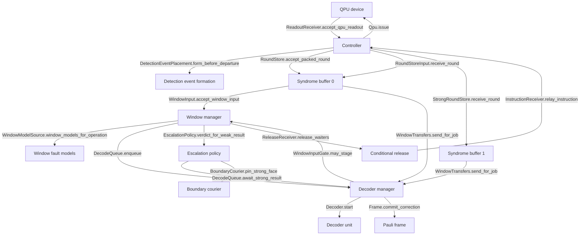

[decsim docs](../README.md) › [Explanation](README.md)

# Architecture

decsim is one root object and a row of components, in the order a
readout travels. This page says what each component is, what it owns and
what it hands on, and why the tree is shaped that way.

## The shape, and where it comes from

Three ideas hold the tree together, and each has a source.

**A component talks to its neighbour only through a port.** A **port**
is a small `typing.Protocol` in `decsim/ports.py` with the methods one
component needs from another. It is structural, so a class fills a port
by having the methods and inherits nothing. A component depends on
ports, never on another component's class, so an implementation can be
replaced without any other component knowing. That is gem5's modular
port interface: "gem5 provides a modular port interface which allows any
component that implements the port API to be connected to any other
component implementing the same API" (Lowe-Power and the gem5 community,
arXiv:2007.03152, lines 489-491 of the text under
`tmp/resources/gem5`).

**A pluggable part is a table of rows.** A row is one name a yaml may
write and one class the machine builds for it. That is sinter's shape,
its `BUILT_IN_DECODERS` dictionary plus one abstract class per pluggable
part, and `decsim/tables.py` is the single function that reads all
seventeen tables so a name off a table is refused the same way
everywhere.

**One root wires everything by constructor.** `decsim/machine.py` builds
every component from its settings and hands each one its neighbours. No
component builds or looks up another. gem5's configuration script does
the same job, naming each component once and assigning its ports.

`decsim/ports.py` is therefore the map of the pipeline, and a reader who
wants to follow a readout starts there. [The ports](../reference/ports.md) is
that file as a page.

## The components, in the order a readout travels

Each arrow is one port method, and the component at its tail is the one
that makes the call. The `%%` lines are mermaid comments naming the
package each node lives in, and `tests/test_docs.py` reads them: it
checks that `decsim/ports.py` declares the method on that port, and
walks the tail's package with an abstract syntax tree to find the call.
An arrow nobody makes fails the suite.

## What each component owns

| Component | Package | It is handed | It hands on |
| --- | --- | --- | --- |
| QPU device | `qpu/` | one operation body per patch | one readout per round, on a cycle boundary of its clock |
| Detection event formation | `detector_error_model/` | one round's raw measurement fragments | the same round as detection events, when the `controller` row is chosen |
| Controller | `controller/` | readouts | one packed round per round, written to every store that must hold it |
| Syndrome buffer 0 | `syndrome_buffer/` | packed rounds | the rounds a weak window reads, kept until every hold releases |
| Syndrome buffer 1 | `syndrome_buffer/` | the same packed rounds, in parallel | the rounds a strong window reads |
| Window manager | `windows/` | published rounds | one decode job per complete window, and each window's boundary to the next |
| Window fault models | `qpu/`, built by `detector_error_model/` | the circuit's whole-circuit error model | one fault model per window |
| Decoder manager | `decoders/` | decode jobs | one result per request, once its input landed and its unit computed |
| Decoder unit | `decoders/` | one input per slot | the correction its backend found, priced at the unit's clock |
| Escalation | `escalation/` | a weak result and its confidence | the verdict: keep it, or re-decode the region on the strong tier |
| Boundary courier | `windows/` | a committed correction | the neighbouring window, with that correction folded into its input |
| Pauli frame | `pauli_frame/` | one correction per window | the folded frame per stream, and the release of whatever waited |
| Conditional release | `controller/` | an operation whose result is final | the instruction back to the QPU |
| Observation | `observe/` | callbacks every component fires | the metrics, the traffic ledger, the trace |

Observation is reached through callbacks a component fires, never
through a port, so every component runs with no observer at all. That is
why `observe/` can be switched off without a single other line changing.

## The pluggable parts

Seventeen tables, listed with every row in [The plug-in tables](../reference/tables.md).
The parts a study is most likely to change:

- the **syndrome source**, which is what the QPU reads out
  (`SYNDROME_SOURCES`);
- the **decoder** on each tier (`DECODERS`);
- the **escalation policy**, which decides whether there are two tiers at
  all (`ESCALATIONS`);
- the **windowing scheme**, which lays out the windows
  (`WINDOWING_SCHEMES`);
- the **link fabric**, which prices the hops (`LINK_FABRICS`);
- the **confidence signal** and the **threshold source**, which decide
  when a window is escalated (`CONFIDENCE_SIGNALS`, `THRESHOLD_SOURCES`).

Every one of them is one class filling one port and one row in a table.
[How to add a row to a table](../how-to/add_a_table_row.md) is the recipe.

## The package order

The packages import each other in one direction only. The `uses`
relation is a partial order, so the top levels can be cut off and the
rest still runs. Parnas states the rule and its point: "We have a
hierarchical structure if a certain relation may be defined between the
modules or programs and that relation is a partial ordering. The
relation we are concerned with is 'uses' or 'depends upon'"
(`parnas1972.txt` lines 504-511), and with the hierarchy "we are able to
cut off the upper levels and still have a usable and useful product"
(lines 518-520). Dijkstra's THE builds the same order level by level,
each level knowing nothing of the levels above it (`dijkstra_the.txt`
lines 52-57).

`tools/check_uses_graph.py`, which `tools/check.sh` runs, fails on any
cycle and prints the levels. There are twenty-five packages on eleven
levels; `decsim/machine.py`'s docstring names them and
[The map of the package](../reference/map.md) lists every module under them. Nothing at level
3 or below imports `decsim/build/` or `decsim/machine.py`, so the
decoders' own tests build a decoder pool and a store and decode a window
with no root at all.

## The line where a call stops being local

The eleven priced hops are that line (Waldo, Wyant, Wollrath and
Kendall, *A Note on Distributed Computing*, `waldo1994.txt` lines
302-304 and 852-855). A call across a hop has a card, a payload a record
names, and a send at one end; a call inside a unit is never priced.

Across that line decsim models latency and memory access and no partial
failure at all: no hop drops, duplicates or reorders what it carries,
and nothing retries. That is a stated scope, written into
`decsim/machine.py`'s own docstring, not an omission. A retry added to a
hop as a tuning knob would be a modelling change, not a parameter.

[The data path, hop by hop](data_path.md) walks all eleven.

## Read next

- [The ports](../reference/ports.md): every port and every method.
- [The map of the package](../reference/map.md): every package and module, in the uses order.
- [The data path, hop by hop](data_path.md): the eleven hops, one at a time.
- [The principles behind the shape](principles.md): the eleven ideas behind this shape.
