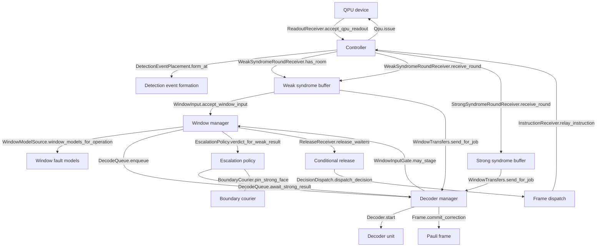

[decsim docs](../README.md) › [Explanation](README.md)

# Architecture

decsim is a row of components, in the order a readout travels, held in
six parts that one machine connects. This page says what each part and
each component is, what it owns and what it hands on, and why the tree
is shaped that way.

## The shape, and where it comes from

Three ideas hold the tree together, and each has a source.

**A component talks to its neighbour only through a port.** A **port**
is a small `typing.Protocol` in `decsim/ports.py` with the methods one
component needs from another. It is structural, so a class fills a port
by having the methods and inherits nothing. A component depends on
ports, never on another component's class, so an implementation can be
replaced without any other component knowing. That is gem5's modular
port interface, quoted in
[The principles behind the shape](principles.md#6-model-objects-a-separate-configuration-script-a-port-api-timing-apart-from-function).

**A pluggable component is a table of rows.** A row is one name a yaml
may write and one class the machine builds for it. That is sinter's
shape, its `BUILT_IN_DECODERS` dictionary plus one abstract class per
pluggable component, and `decsim/tables.py` is the single function that reads every
table, so a name that is not on a table is refused the same
way everywhere.

**Each part wires its own inside, and the machine connects the parts.**
A part is a small record in `decsim/build/` of the components one stage
of the loop holds. Its `build` makes those components from their
settings and binds the ports between them. `Machine.assemble` in
`decsim/machine.py` then binds the ports that cross from one part to
another, so its four `connect` calls are the whole list of those. The
one exception is the link fabric: every hop rides it, so it is built
first and handed to each part's `build`. No
component builds or looks up another. That is gem5's standard library,
where a board is handed a processor, a memory and a cache hierarchy that
each wire their own inside, and OMNeT++'s compound module, which shows
its parent only its own gates.

`decsim/ports.py` is therefore the map of the pipeline, and a reader who
wants to follow a readout starts there. [The ports](../reference/ports.md) is
that file as a page.

## The six parts

| Part | File | It holds | Its `connect` binds it to |
| --- | --- | --- | --- |
| QPU | `decsim/build/qpu.py` | the device, its syndrome source, the magic state factory | the controller it reads out to, the runtime and the idle rounds it reports to, the decoder manager a factory decodes on |
| Control | `decsim/build/control.py` | the execution runtime, the issuer, the instruction output, the Pauli frame, the conditional release | the QPU it drives, and the window manager it hands each stream |
| Readout | `decsim/build/readout.py` | the controller, the packing stage, both syndrome buffers and their receivers | the window manager each stored round is published to |
| Windows | `decsim/build/windows.py` | the planner, the window manager, the verdict, the strong re-decode | the stores, the decoders, the frame and the release |
| Decoders | `decsim/build/decoders.py` | each tier's units and the manager that schedules them | nothing: the other parts bind to it |
| Links | `decsim/machine.py` `build_links` | the link fabric | nothing: every part sends on it |

`Machine.build` compiles what every part is built for (the escalation
policy, the plan, the burst detector, the detection event formation and
the decoder pool), then builds the parts one line each and hands them to
`Machine.assemble`. A script that replaces one part does the same steps
and builds its own part in that part's line.
[Build a machine step by step](../tutorials/build_a_machine.md) walks
through it.

A part also answers for its components at the two ends of a run.
`start` readies them once every wire is made (the managers learn their
decoders, the planner builds its window models), `check_settled` stops
the run if anything is still held at the end, and `seed_roots` names
the components that draw random numbers, each by the path its seed is
derived from.

## The components, in the order a readout travels

```mermaid
graph TD
    %% Qpu = qpu
    %% Controller = controller
    %% Formation = detector_error_model
    %% WeakBuffer = syndrome_buffer
    %% StrongBuffer = syndrome_buffer
    %% Windows = windows
    %% Models = qpu
    %% Decoders = decoders
    %% Unit = decoders
    %% Escalation = escalation
    %% Courier = windows
    %% Frame = pauli_frame
    %% Release = controller
    %% Dispatch = pauli_frame
    Qpu["QPU device"] -->|"ReadoutReceiver.accept_qpu_readout"| Controller
    Controller -->|"DetectionEventPlacement.form_at"| Formation["Detection event formation"]
    Controller -->|"WeakSyndromeRoundReceiver.has_room"| WeakBuffer["Weak syndrome buffer"]
    Controller -->|"WeakSyndromeRoundReceiver.receive_round"| WeakBuffer
    Controller -->|"StrongSyndromeRoundReceiver.receive_round"| StrongBuffer["Strong syndrome buffer"]
    WeakBuffer -->|"WindowInput.accept_window_input"| Windows["Window manager"]
    Windows -->|"WindowModelSource.window_models_for_operation"| Models["Window fault models"]
    Windows -->|"DecodeQueue.enqueue"| Decoders["Decoder manager"]
    WeakBuffer -->|"WindowTransfers.send_for_job"| Decoders
    Decoders -->|"WindowInputGate.may_stage"| Windows
    Decoders -->|"Decoder.start"| Unit["Decoder unit"]
    Windows -->|"EscalationPolicy.verdict_for_weak_result"| Escalation["Escalation policy"]
    Escalation -->|"DecodeQueue.await_strong_result"| Decoders
    Escalation -->|"BoundaryCourier.pin_strong_face"| Courier["Boundary courier"]
    StrongBuffer -->|"WindowTransfers.send_for_job"| Decoders
    Decoders -->|"Frame.commit_correction"| Frame["Pauli frame"]
    Windows -->|"ReleaseReceiver.release_waiters"| Release["Conditional release"]
    Release -->|"DecisionDispatch.dispatch_decision"| Dispatch["Frame dispatch"]
    Dispatch -->|"InstructionReceiver.relay_instruction"| Controller
    Controller -->|"Qpu.issue"| Qpu
```

Each arrow is one port method, and the component at its tail is the one
that makes the call. The `%%` lines are mermaid comments naming the
package each node lives in, and `tests/test_docs.py` reads them: it
checks that `decsim/ports.py` declares the method on that port, and
walks the tail's package with an abstract syntax tree to find the call.
An arrow nobody makes fails the suite.

## What each component owns

| Component | Package | It is handed | It hands on |
| --- | --- | --- | --- |
| QPU device | `qpu/` | the circuit of one logical operation, for each patch (the block of physical qubits holding one logical qubit) | one readout per round, on a cycle boundary of its clock |
| Detection event formation | `detector_error_model/` | one round's raw measurement fragments | the same round as detection events, when the `controller` row is chosen |
| Controller | `controller/` | readouts | one packed round per round, written to every store that must hold it |
| The weak syndrome buffer | `syndrome_buffer/` | packed rounds | the rounds a weak window reads, kept until every hold releases (a hold is a note from one reader saying it may still need the round) |
| The strong syndrome buffer | `syndrome_buffer/` | the same packed rounds, in parallel | the rounds a strong window reads |
| Window manager | `windows/` | published rounds | one decode job per complete window, and each window's boundary to the next |
| Window fault models | `qpu/`, built by `detector_error_model/` | the circuit's whole-circuit error model | one fault model per window |
| Decoder manager | `decoders/` | decode jobs | one result per request, once its input landed and its unit computed |
| Decoder unit | `decoders/` | one input per slot | the correction its backend found, priced at the unit's clock |
| Escalation | `escalation/` | a weak result and its confidence | the verdict: keep it, or re-decode the region on the strong tier |
| Burst detector | `burst_detectors/` | each round's detection events, as they are formed | a flag, which sends the windows it meets to the strong tier |
| Boundary courier | `windows/` | a committed correction | the neighbouring window, with that correction folded into its input |
| Pauli frame | `pauli_frame/` | one correction per window | the folded frame per stream, and the release of whatever waited |
| Conditional release | `controller/` | an operation whose result is final | the decision, which the frame's end sends and the controller relays as the instruction to the QPU |
| Observation | `observe/` | callbacks every component fires | the metrics, the traffic ledger, the trace |

Observation is reached through callbacks a component fires, never
through a port, so every component runs with no observer at all. That is
why `observe/` can be switched off without a single other line changing.

## The pluggable components

Every table is listed with every row in [The plug-in tables](../reference/tables.md).
The ones a study is most likely to change:

- the **syndrome source**, which is what the QPU reads out
  (`SYNDROME_SOURCES`);
- the **decoder** on each tier (`DECODERS`);
- the **escalation kind**, which says which decode slots a run fills
  (`ESCALATION_KINDS`);
- the **windowing scheme**, which lays out the windows
  (`WINDOWING_SCHEMES`);
- the **link fabric**, which prices the hops (`LINK_FABRICS`);
- the **confidence signal** and the **threshold source**, which decide
  when a window is escalated (`CONFIDENCE_SIGNALS`, `THRESHOLD_SOURCES`);
- the **burst detector**, which sends the windows a burst of errors
  covers to the strong tier (`BURST_DETECTORS`).

Every one of them is one class filling one port and one row in a table.
[How to add a row to a table](../how-to/add_a_table_row.md) is the recipe.

## The package order

The packages import each other in one direction only. The `uses`
relation is a partial order, so the top levels can be cut off and the
rest still runs; Parnas and Dijkstra are quoted for it in
[The principles behind the shape](principles.md#2-the-uses-relation-is-a-partial-order).

`tools/check_uses_graph.py`, which `tools/check.sh` runs, fails on any
cycle and prints the packages level by level. `decsim/machine.py`'s
docstring names them and
[The map of the package](../reference/map.md) lists every module under them. Nothing at level
3 or below imports `decsim/build/` or `decsim/machine.py`, so the
decoders' own tests build a decoder pool and a store and decode a window
with no root at all.

## The line where a call stops being local

A priced hop is a link between two components that charges a latency,
and the [data path](data_path.md) walks all eleven. Those hops are that
line, and Waldo is quoted for it in
[The principles behind the shape](principles.md#11-local-and-remote-calls-differ-in-kind-and-the-interface-must-say-which).
A call across a hop has a card, a payload a record names, and a send at
one end; a call inside a unit is never priced.

Across that line decsim models latency, memory access, and partial
failure only where a card's protocol names it, as `decsim/machine.py`'s
own docstring states. The `ideal` row, every card's default, drops,
duplicates and reorders nothing and never retries. The `credit` row
cuts a message into frames that wait for a finite receive buffer's
credits. The `reliable` row loses frames at the card's bit error rate
and resends them by go-back-N, so every message still arrives once and
in order and no component above the hop ever sees the loss; when the
card's retry count runs out, the link has failed and the run stops with
an error naming the channel and the frame.

[The data path, hop by hop](data_path.md) walks all eleven.

## Read next

- [The ports](../reference/ports.md): every port and every method.
- [The map of the package](../reference/map.md): every package and module, in the uses order.
- [The data path, hop by hop](data_path.md): the eleven hops, one at a time.
- [The principles behind the shape](principles.md): the eleven ideas behind this shape.
