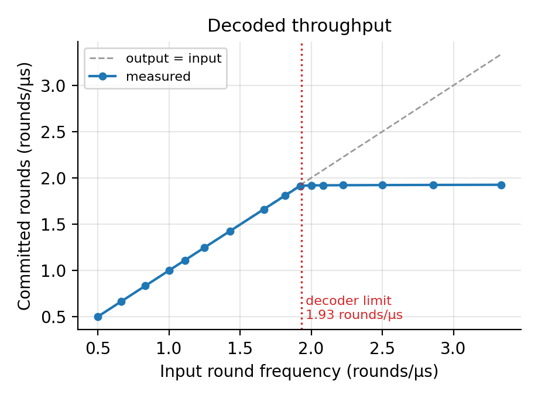
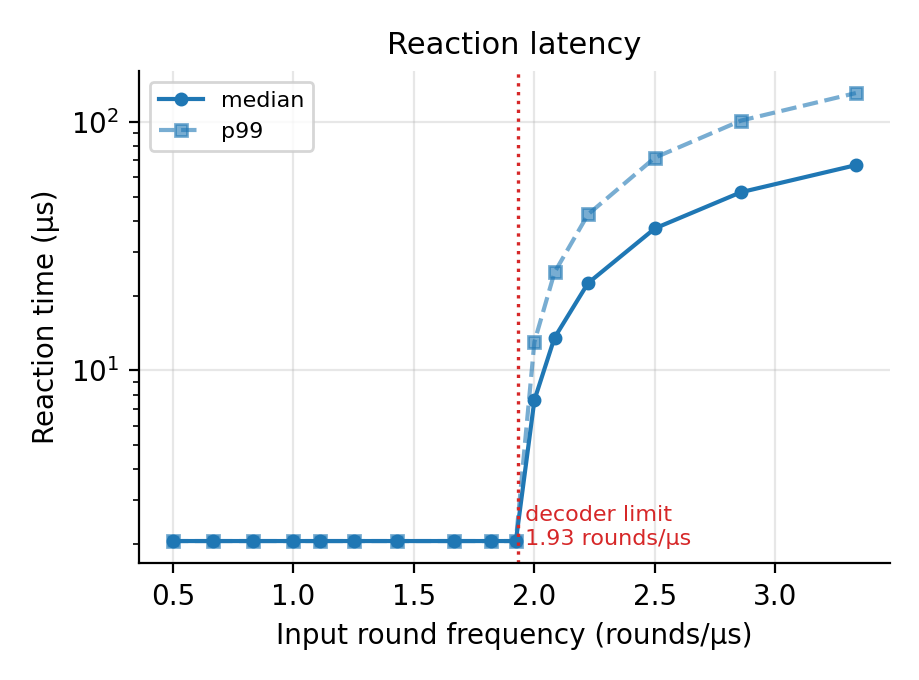
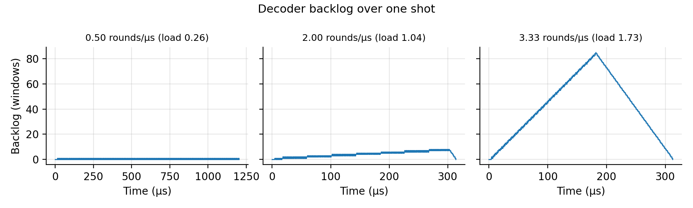
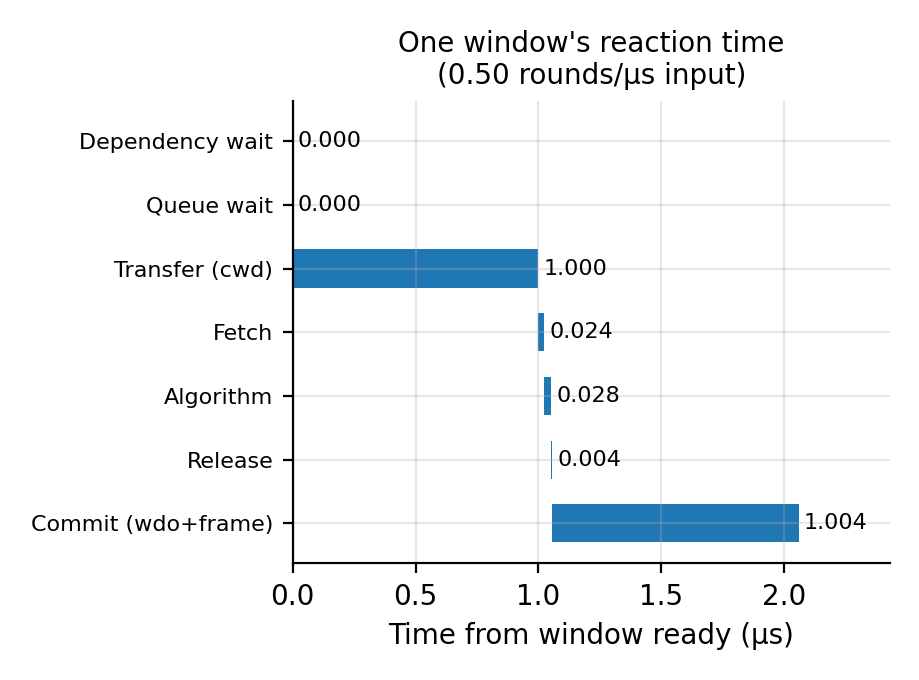
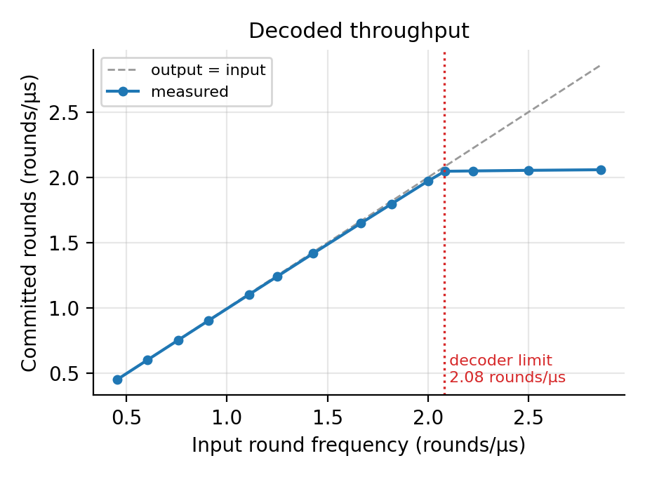
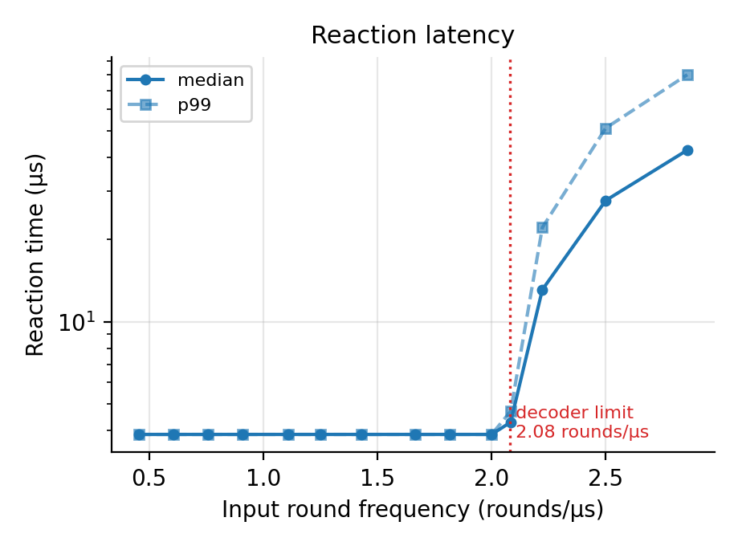
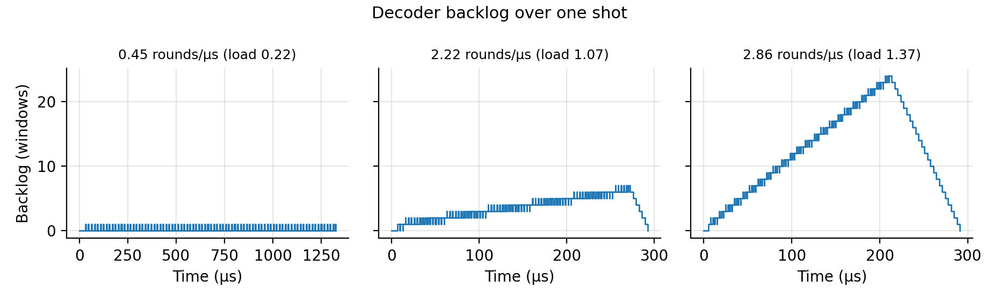
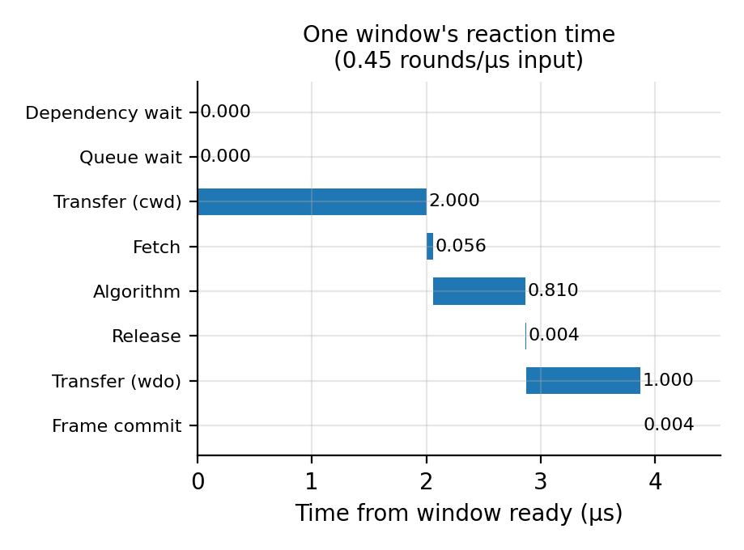

# Weak decoder walkthrough

A step by step tour of decsim's baseline closed loop, built around one small
example you can check by hand. Every command below runs from the repository
root. Every script referenced here lives in this folder, and its full code is
printed in its section, so this file doubles as a copy-paste tutorial.

| Step | What it shows | Run |
|---|---|---|
| 1 | The small example computed by hand | `PYTHONPATH=. python guide/walkthrough/analytic_small_run.py` |
| 2 | The simulator reproducing it to the tick | `PYTHONPATH=. python guide/walkthrough/simulated_small_run.py` |
| 1+2 | Both, cell by cell with every input and output | `small_run.ipynb` (a viewing layer; the scripts above run without it) |
| 3 | The Stim circuit: inputs, outputs, breaking a detector | `PYTHONPATH=. python guide/walkthrough/stim_circuit_tour.py` |
| 4 | Round frequencies: input rounds and syndrome rounds | (reading, uses step 1 and 2 numbers) |
| 5 | Throughput and latency vs input round frequency | `PYTHONPATH=. python guide/walkthrough/run_frequency_sweep.py` then `frequency_plots.py` |

## 0. Setup

decsim simulates the full reaction path of a windowed QEC decoder:

```
QPU rounds -> QC link -> controller (pulses to binary, packing) -> C2B link
-> Buffer 0 -> window manager -> CWD link -> decoder memory
-> decoder engine (fetch, algorithm, release) -> WDO link -> Pauli frame commit
```

Every experiment is one yaml file naming every cost, plus one command:

```bash
PYTHONPATH=. python -m experiments.baseline.baseline_closed_loop <config.yaml>
```

`PYTHONPATH=.` makes `decsim` and `experiments` importable from the root.
The yaml is the single source of every parameter; nothing is hard-coded in
the runner.

## 1. The small example, by hand

The case: distance 3, 12 QEC rounds, zero noise, sliding windows that commit
3 rounds and read 3 more as look-ahead. That yields exactly 3 windows:

| window | reads rounds | commits rounds |
|---|---|---|
| 0 | 1 to 6 | 1 to 3 |
| 1 | 4 to 9 | 4 to 6 |
| 2 | 7 to 12 | 7 to 12 (the last window commits everything left) |

The costs, frozen in `guide/walkthrough/small_run.yaml`, are all whole
microseconds so every timestamp of the run is a whole number: round period
3, QC link 1, C2B link 1, CWD link 1, DD handoff 1, WDO link 1, algorithm
1, fetch 3 (6 rounds at 0.5 µs each; the 2 MHz engine clock is chosen only
so fetch and release come out whole), release 1, frame commit 1. Every
link has unbounded bandwidth, so latency is the whole cost. The same case
with the repository's reference-card numbers is
`experiments/validation/analytic_oracle_d3_r12.yaml`.

Five formulas produce the entire run:

```
publication(r) = 3r + 1 + 1 = 3r + 2                round r reaches Buffer 0
ready(w)       = publication(last round w reads)    window is decodable
queued(w)      = max(ready(w), done(w-1) + 1)       wait for the dd handoff
done(w)        = queued(w) + 1 + 3 + 1 + 1          cwd + fetch + algorithm + release
commit(w)      = done(w) + 1 + 1                    wdo + frame commit
```

Window 0, fully worked: round 6 is published at 3 x 6 + 2 = 20, so ready =
20. No predecessor, so it dispatches at 20. Service is 6 (CWD 1, fetch 3,
algorithm 1, release 1), so done = 26. Commit = 26 + 2 = 28. Reaction time
= 28 - 20 = 8 µs.

Window 1: ready at 29. Its dependency (window 0's dd handoff) arrived at
27, earlier, so it dispatches at 29, done 35, commit 37. Window 2: the
same pattern, one window period (9 µs) later: commit 46.

The full answer key, printed by `analytic_small_run.py`:

| window_id | read_lo | read_hi | commit_lo | commit_hi | buffer0_ready_us | queued_us | dispatch_us | decode_done_us | dd_delivery_us | frame_commit_us | buffer0_ready_to_frame_us |
|---|---|---|---|---|---|---|---|---|---|---|---|
| 0 | 1 | 6 | 1 | 3 | 20 | 20 | 20 | 26 | 27 | 28 | 8 |
| 1 | 4 | 9 | 4 | 6 | 29 | 29 | 29 | 35 | 36 | 37 | 8 |
| 2 | 7 | 12 | 7 | 12 | 38 | 38 | 38 | 44 | | 46 | 8 |

The code (`analytic_small_run.py`):

```python
"""The small example by hand: 12 rounds, 3 sliding windows, zero noise.

guide/walkthrough/small_run.yaml freezes every cost as a whole number of
microseconds, so every timestamp of the run follows from arithmetic:

    publication(r) = r x round_period + qc + binary + pack + c2b
    ready(w)       = publication(last round the window reads)
    queued(w)      = max(ready(w), previous window's decode done + dd)
    done(w)        = queued(w) + cwd + fetch + algorithm + release
    commit(w)      = done(w) + wdo + frame commit

This script is that arithmetic written out once, so the simulator has an
exact answer key. guide/walkthrough/simulated_small_run.py replays the same
yaml in the simulator and fails loudly on any difference.

    PYTHONPATH=. python guide/walkthrough/analytic_small_run.py
"""

from pathlib import Path

from experiments.baseline.baseline_closed_loop import load_config

CONFIG = Path("guide/walkthrough/small_run.yaml")

COLUMNS = ("window_id", "read_lo", "read_hi", "commit_lo", "commit_hi",
           "buffer0_ready_us", "queued_us", "dispatch_us", "decode_done_us",
           "dd_delivery_us", "frame_commit_us", "buffer0_ready_to_frame_us")


def window_layout(rounds: int, commit_rounds: int, buffer_rounds: int) -> list:
    """Sliding windows: window k commits rounds k*c+1 .. k*c+c and reads
    buffer_rounds beyond them for context; the last window that still fits
    commits and reads everything left."""
    windows = []
    window_id = 0
    while window_id * commit_rounds + commit_rounds + buffer_rounds <= rounds:
        read_lo = window_id * commit_rounds + 1
        windows.append({"window_id": window_id,
                        "read_lo": read_lo,
                        "read_hi": read_lo + commit_rounds + buffer_rounds - 1,
                        "commit_lo": read_lo,
                        "commit_hi": read_lo + commit_rounds - 1})
        window_id += 1
    last_window = windows[-1]
    last_window["read_hi"] = rounds
    last_window["commit_hi"] = rounds
    return windows


def analytic_timeline(config: dict) -> list:
    """One row per window, every timestamp in microseconds, from the yaml's
    numbers alone."""
    block = config["sweep"][0]
    round_period_us = block["round_period_us"][0]
    algorithm_us = block["algorithm_latency_us"][0]
    links = config["links"]
    controller = config["controller"]
    engine = config["decoder"]["engine"]
    engine_cycle_us = 1.0 / engine["frequency_mhz"]

    # Round r leaves the QPU when it finishes, at r x round_period. It is
    # published in Buffer 0 one constant offset later: the QC link, the
    # controller's pulses-to-binary step, packing, and the C2B link. Every
    # link of this yaml has unbounded bandwidth, so there is no serialization.
    publication_offset_us = (links["qc"]["latency_us"]
                             + controller["t_binary_availability_us"]
                             + controller["t_pack_us"]
                             + links["c2b"]["latency_us"])

    windows = window_layout(config["rounds_per_shot"],
                            config["windowing"]["commit_rounds"],
                            config["windowing"]["buffer_rounds"])
    rows = []
    previous_done_us = None
    for window in windows:
        ready_us = window["read_hi"] * round_period_us + publication_offset_us
        if previous_done_us is None:
            queued_us = ready_us          # the first window has no dependency
        else:
            dependency_arrival_us = previous_done_us + links["dd"]["latency_us"]
            queued_us = max(ready_us, dependency_arrival_us)
        dispatch_us = queued_us           # one decoder unit, idle again by then

        rounds_fetched = window["read_hi"] - window["read_lo"] + 1
        service_us = (links["cwd"]["latency_us"]
                      + rounds_fetched * engine["fetch_cycles_per_round"] * engine_cycle_us
                      + algorithm_us
                      + engine["release_cycles_per_job"] * engine_cycle_us)
        done_us = dispatch_us + service_us
        commit_us = done_us + links["wdo"]["latency_us"] + config["pauli_frame"]["commit_us"]

        last_window = window["read_hi"] == config["rounds_per_shot"]
        rows.append({**window,
                     "buffer0_ready_us": ready_us,
                     "queued_us": queued_us,
                     "dispatch_us": dispatch_us,
                     "decode_done_us": done_us,
                     # DD hands the boundary to the NEXT window's decode; the
                     # last window has no successor and sends nothing.
                     "dd_delivery_us": None if last_window else done_us + links["dd"]["latency_us"],
                     "frame_commit_us": commit_us,
                     "buffer0_ready_to_frame_us": commit_us - ready_us})
        previous_done_us = done_us
    return rows


def print_table(rows: list, columns: tuple = COLUMNS) -> None:
    def cell(value):
        if value is None:
            return ""
        if isinstance(value, float):
            return f"{value:g}"
        return str(value)
    print("| " + " | ".join(columns) + " |")
    print("|" + "---|" * len(columns))
    for row in rows:
        print("| " + " | ".join(cell(row[column]) for column in columns) + " |")


if __name__ == "__main__":
    print_table(analytic_timeline(load_config(CONFIG)))
```

## 2. The same run in the simulator

`simulated_small_run.py` builds the identical run through the experiment
runner (`build_run`), replays it, reads every timestamp out of the
simulator's own records (window manager timestamps, link transfer log,
Pauli frame records), and compares cell by cell:

```
$ PYTHONPATH=. python guide/walkthrough/simulated_small_run.py
...
MATCH: all 36 cells agree to the tick.
```

The simulator's table is identical to the answer key above, including the
8 µs reaction time of every window. This is the point of the small
example: nothing inside the simulator is fitted or approximate, every
timestamp is the yaml's arithmetic, executed by the event loop.

Column glossary (all in microseconds from the start of the shot):

| column | meaning |
|---|---|
| read_lo, read_hi | first and last round the window decodes |
| commit_lo, commit_hi | rounds whose corrections this window commits |
| buffer0_ready_us | the window's last required round is published in Buffer 0 |
| queued_us | dependencies satisfied, job enters the ready queue |
| dispatch_us | a decoder unit picks the job up |
| decode_done_us | dispatch + CWD transfer + fetch + algorithm + release |
| dd_delivery_us | the boundary handoff reaches the next window's decode |
| frame_commit_us | the correction is committed into the Pauli frame |
| buffer0_ready_to_frame_us | the reaction time: ready to committed |

The code (`simulated_small_run.py`):

```python
"""The same small run through the simulator, timestamp for timestamp.

Builds the run from the same yaml the answer key uses, replays it, reads
each window's timestamps out of the simulator's own records, prints both
tables and fails loudly on any difference.

    PYTHONPATH=. python guide/walkthrough/simulated_small_run.py
"""

import sys

from analytic_small_run import COLUMNS, CONFIG, analytic_timeline, print_table
from decsim.config import TICKS_PER_US
from experiments.baseline.baseline_closed_loop import build_run, load_config


def us(ticks: int) -> float:
    return ticks / TICKS_PER_US


def simulated_timeline(config: dict) -> list:
    """One row per window, the same columns as the answer key, but every
    number read out of the completed simulation."""
    block = config["sweep"][0]
    spec, _ = build_run(config,
                        physical_error_probability=block["physical_error_probability"][0],
                        round_period_us=block["round_period_us"][0],
                        algorithm_latency_us=block["algorithm_latency_us"][0],
                        seed=0)
    completed = spec.build()

    transfers = completed.result.link_traffic["transfers"]
    delivery = {(row["path"], row["attribution"]["window_id"]): row["delivery_ticks"]
                for row in transfers if row["path"] in ("dd", "wdo")}
    frame_by_window = {record.window_key[1]: record
                       for record in completed.pauli_frame.snapshot().records}

    rows = []
    last_round = config["rounds_per_shot"]
    for (operation_id, window_id), window in sorted(completed.window_manager.windows.items()):
        frame_record = frame_by_window[window_id]
        dd_delivery_ticks = delivery.get(("dd", window_id))
        rows.append({
            "window_id": window_id,
            "read_lo": window.start_round,
            "read_hi": min(window.buffer_hi, last_round),
            "commit_lo": window.commit_lo,
            "commit_hi": window.commit_hi,
            "buffer0_ready_us": us(window.t_data_complete),
            "queued_us": us(window.t_queued),
            "dispatch_us": us(window.t_dispatch),
            "decode_done_us": us(window.t_done),
            "dd_delivery_us": None if dd_delivery_ticks is None else us(dd_delivery_ticks),
            "frame_commit_us": us(frame_record.committed_ticks),
            "buffer0_ready_to_frame_us": us(frame_record.committed_ticks - window.t_data_complete),
        })
    return rows


def normalized(value):
    """Ticks are whole microseconds x 1e6, so six decimals compare exactly."""
    if isinstance(value, float):
        return round(value, 6)
    return value


def differences(analytic_rows: list, simulated_rows: list) -> list:
    """Every (window, column, analytic, simulated) cell that disagrees."""
    disagreements = []
    if len(analytic_rows) != len(simulated_rows):
        disagreements.append(("window count", "", len(analytic_rows), len(simulated_rows)))
    for analytic_row, simulated_row in zip(analytic_rows, simulated_rows):
        for column in COLUMNS:
            analytic_value = normalized(analytic_row[column])
            simulated_value = normalized(simulated_row[column])
            if analytic_value != simulated_value:
                disagreements.append((analytic_row["window_id"], column,
                                      analytic_value, simulated_value))
    return disagreements


def main() -> None:
    config = load_config(CONFIG)
    analytic_rows = analytic_timeline(config)
    simulated_rows = simulated_timeline(config)

    print("Analytic answer key:")
    print_table(analytic_rows)
    print()
    print("Simulator:")
    print_table(simulated_rows)
    print()

    disagreements = differences(analytic_rows, simulated_rows)
    if disagreements:
        for window_id, column, analytic_value, simulated_value in disagreements:
            print(f"MISMATCH window {window_id} {column}: "
                  f"analytic {analytic_value} vs simulated {simulated_value}")
        sys.exit(1)
    cells = len(analytic_rows) * len(COLUMNS)
    print(f"MATCH: all {cells} cells agree to the tick.")


if __name__ == "__main__":
    main()
```

## 3. Inside the Stim circuit

The QPU end of the loop replays a Stim circuit. What goes in is the circuit;
what comes out, round by round, is detection events (syndrome bits) plus, at
the very end, the truth about the logical observable.

Run the tour:

```bash
PYTHONPATH=. python guide/walkthrough/stim_circuit_tour.py
```

**What goes in.** `stim.Circuit.generated("surface_code:rotated_memory_z",
rounds=12, distance=3)` builds a d=3 rotated surface code memory: 9 data
qubits, 8 ancillas (4 X-type, 4 Z-type), 12 measurement rounds, one final
transversal data measurement. The tour prints the whole circuit.

**What comes out.** A detector is a parity comparison between two
consecutive measurements of the same stabilizer; a detection event means the
parity changed. For this circuit:

```
detectors: 96, logical observables: 1
detectors per round: round 1: 4, rounds 2..12: 8 each, final layer: 4
```

Round 1 has 4 detectors (only the Z-type ancillas start deterministic in
memory_z), full rounds have 8, and the final data measurement adds one last
layer of 4. These counts are exactly the syndrome payload bits the simulator
serializes over the links: 4 bits for round 1, 8 bits for the middle rounds,
and 12 for the last round once the final layer is folded into it.

**One clean shot.** With zero noise, no detector fires and the observable
does not flip. Detection events are deviations from the circuit's own
noiseless reference. That is also why breaking a detector needs an error
channel: a plain deterministic `X` gate becomes part of the reference and
fires nothing, while `X_ERROR(1)` is noise that always happens.

**Break a detector.** One `X_ERROR(1)` on the middle data qubit (qubit 10 at
coordinates (3,3)) between rounds 6 and 7:

```
fired: detector 45 at (x=2, y=2, round=7)
fired: detector 50 at (x=4, y=4, round=7)
observable actually flipped: False
decoder predicts a flip:     False
logical error after correction: False
```

Exactly the two Z stabilizers touching that qubit see the flip, in the first
comparison after the error, and never again (later comparisons agree with
each other). PyMatching pairs the two events, the correction is right, no
logical error. The decoding graph comes from the same circuit with a small
error probability on every channel: a decoder needs a noise model to know
which event pairs are plausible.

**Break the code.** A chain of d=3 X errors down the leftmost column of data
qubits (qubits 1, 8, 15) commutes with every stabilizer:

```
detection events fired: 0 of 96
observable actually flipped: True
decoder predicts a flip:     False
logical error after correction: True
```

Zero detectors fire, yet the logical observable flipped: this is a logical
error, invisible to any decoder by construction. Single errors light up
detectors; error chains that cross the patch are exactly what the code
cannot see, which is why the logical error rate falls exponentially with
distance.

The code (`stim_circuit_tour.py`):

```python
"""A tour of the Stim circuit: what goes in, what comes out, how to break it.

The simulator's QPU replays a Stim circuit. This script builds the same
d=3, 12-round memory circuit the small example uses and shows, with zero
noise so every outcome is deterministic:

  1. the circuit itself, and how many detectors it produces per round,
  2. that a clean run fires no detectors,
  3. one injected X error: exactly two detectors fire and the decoder
     corrects it,
  4. a chain of d injected X errors crossing the patch: zero detectors
     fire, the logical observable flips, and no decoder can see it.

    PYTHONPATH=. python guide/walkthrough/stim_circuit_tour.py
"""

from collections import Counter

import numpy as np
import pymatching
import stim

DISTANCE = 3
ROUNDS = 12
BREAK_AFTER_ROUND = 6      # errors are injected between round 6 and round 7


def noiseless_circuit() -> stim.Circuit:
    return stim.Circuit.generated("surface_code:rotated_memory_z",
                                  rounds=ROUNDS, distance=DISTANCE)


def decoding_graph() -> pymatching.Matching:
    """PyMatching needs a decoding graph, and the graph comes from a noise
    model: the same circuit with a small error probability on every channel.
    The graph then decodes detection events from anywhere, including the
    deterministic broken circuits below."""
    noisy = stim.Circuit.generated(
        "surface_code:rotated_memory_z", rounds=ROUNDS, distance=DISTANCE,
        after_clifford_depolarization=0.001, before_round_data_depolarization=0.001,
        before_measure_flip_probability=0.001, after_reset_flip_probability=0.001)
    return pymatching.Matching.from_detector_error_model(
        noisy.detector_error_model(decompose_errors=True))


def data_qubits(circuit: stim.Circuit) -> list:
    """The data qubits are the targets of the final measurement."""
    final_measurement = [instruction for instruction in circuit.flattened()
                         if instruction.name == "M"][-1]
    return [target.value for target in final_measurement.targets_copy()]


def logical_x_chain(circuit: stim.Circuit) -> list:
    """A vertical chain of X errors crossing the patch is the logical X
    operator: it commutes with every stabilizer, so no detector ever fires,
    yet it flips the measured logical Z. Any column of data qubits works;
    this takes the leftmost."""
    coordinates = circuit.get_final_qubit_coordinates()
    columns = {}
    for qubit in data_qubits(circuit):
        x_coordinate = coordinates[qubit][0]
        columns.setdefault(x_coordinate, []).append(qubit)
    leftmost_column = min(columns)
    return columns[leftmost_column]


def with_x_errors(circuit: stim.Circuit, qubits: list, after_round: int) -> stim.Circuit:
    """The circuit with X_ERROR(1), an always-fired X error, on `qubits`
    between `after_round` and the next round.

    It must be an error channel, not a plain X gate: a detection event is a
    deviation from the circuit's own noiseless reference, so a deterministic
    gate is absorbed into the reference and fires nothing. Rounds are counted
    by their MR (measure and reset the ancillas) instruction; the error adds
    no measurement records, so every detector definition is untouched."""
    broken = stim.Circuit()
    rounds_measured = 0
    inserted = False
    for instruction in circuit.flattened():
        broken.append(instruction)
        if instruction.name == "MR":
            rounds_measured += 1
            if rounds_measured == after_round and not inserted:
                broken.append("X_ERROR", qubits, 1.0)
                inserted = True
    return broken


def sample(circuit: stim.Circuit) -> tuple:
    """(detection events, observable flip) of one shot. With no random noise
    in the circuit the sample is exact, not statistical."""
    events, observable_flips = circuit.compile_detector_sampler().sample(
        shots=1, separate_observables=True)
    return events[0], bool(observable_flips[0][0])


def detectors_per_round(circuit: stim.Circuit) -> Counter:
    """How many detectors compare each round: the third detector coordinate
    is the round (0-based); the final data measurement adds one last layer."""
    rounds = Counter()
    for coordinates in circuit.get_detector_coordinates().values():
        rounds[int(coordinates[2])] += 1
    return rounds


def describe_fired(circuit: stim.Circuit, events: np.ndarray) -> list:
    coordinates = circuit.get_detector_coordinates()
    return [f"detector {index} at (x={coordinates[index][0]:g}, "
            f"y={coordinates[index][1]:g}, round={int(coordinates[index][2]) + 1})"
            for index in np.flatnonzero(events)]


def main() -> None:
    circuit = noiseless_circuit()
    matching = decoding_graph()

    print("=== 1. What goes in: the circuit ===")
    print(circuit)
    print()
    print(f"qubits: {circuit.num_qubits}, data qubits: {sorted(data_qubits(circuit))}")
    print(f"detectors: {circuit.num_detectors}, logical observables: {circuit.num_observables}")
    tally = detectors_per_round(circuit)
    print("detectors per round (round: count):",
          {round_index + 1: count for round_index, count in sorted(tally.items())})
    print()

    print("=== 2. What comes out: one clean shot ===")
    events, observable_flip = sample(circuit)
    print(f"detection events fired: {int(events.sum())} of {events.size}")
    print(f"logical observable flipped: {observable_flip}")
    print()

    print("=== 3. Break a detector: one X error on the middle data qubit ===")
    middle_qubit = 10                    # coordinates (3, 3), the patch center
    one_error = with_x_errors(circuit, [middle_qubit], BREAK_AFTER_ROUND)
    events, observable_flip = sample(one_error)
    print(f"injected: X_ERROR(1) on qubit {middle_qubit} between rounds "
          f"{BREAK_AFTER_ROUND} and {BREAK_AFTER_ROUND + 1}")
    for line in describe_fired(one_error, events):
        print("fired:", line)
    predicted_flip = bool(matching.decode(events)[0])
    print(f"observable actually flipped: {observable_flip}")
    print(f"decoder predicts a flip:     {predicted_flip}")
    print(f"logical error after correction: {observable_flip != predicted_flip}")
    print()

    print("=== 4. Break the code: a chain of X errors crossing the patch ===")
    chain = logical_x_chain(circuit)
    logical_error = with_x_errors(circuit, chain, BREAK_AFTER_ROUND)
    events, observable_flip = sample(logical_error)
    print(f"injected: X_ERROR(1) on qubits {chain}, a full column, between rounds "
          f"{BREAK_AFTER_ROUND} and {BREAK_AFTER_ROUND + 1}")
    print(f"detection events fired: {int(events.sum())} of {events.size}")
    predicted_flip = bool(matching.decode(events)[0])
    print(f"observable actually flipped: {observable_flip}")
    print(f"decoder predicts a flip:     {predicted_flip}")
    print(f"logical error after correction: {observable_flip != predicted_flip}")


if __name__ == "__main__":
    main()
```

## 4. Round frequencies

**Input round frequency.** The QPU finishes one QEC round every
`round_period_us`, so the input round frequency is `1 / round_period_us`
rounds per microsecond. At the small example's 1.0 µs period, that is 1.0
round/µs; superconducting hardware today runs around 1 µs cycles, which is
why the sweep centers there.

**Syndrome round frequency at Buffer 0.** Each round's syndrome bits travel
QPU -> QC link -> controller -> C2B link -> Buffer 0, a constant offset per
round. In the small example the publications land at 5, 8, ..., 38 µs: the
same frequency as the input rounds (one per 3 µs), shifted by 2 µs. Links do
not change the rate, only the phase, as long as their bandwidth is not the
bottleneck.

**Window frequency.** The decoder does not see rounds, it sees windows: one
window per `commit_rounds` rounds. At commit 3, the window arrival frequency
is one third of the round frequency, and each window carries
`commit_rounds + buffer_rounds` rounds of data to fetch.

The decoder must finish one window per window arrival. One window costs
`service = cwd + fetch + algorithm + release`, and consecutive windows are
chained by the dd boundary handoff. So the sustainable input round frequency
is:

```
knee frequency = commit_rounds / (service + dd)     [rounds per microsecond]
```

Below the knee, latency is flat and independent of the input frequency.
Above it, windows arrive faster than they finish; the backlog and therefore
the latency grow without bound. Section 5 measures exactly this.

## 5. Throughput and latency vs input round frequency

The sweep (`frequency_sweep.yaml`) reuses the baseline yaml unchanged except
for long shots and a dense frequency axis:

```yaml
# The walkthrough's sweep: how the input round frequency moves the weak
# decoder's throughput and latency. Everything not named here comes from
# the baseline yaml (same code, same links, same decoder).
#
# With the baseline links and the 0.028 us card, one window costs
#   service = cwd 1.0 + fetch 6 x 0.004 + algorithm 0.028 + release 0.004 = 1.056 us
# and consecutive windows are chained by the dd handoff (0.5 us), so the
# decoder finishes one window every 1.556 us at best. A window arrives every
# commit_rounds x round_period = 3 x round_period, so the knee sits at
#   round_period = 1.556 / 3 = 0.519 us  (input frequency 1.93 rounds/us).
# The periods below cover both sides of that knee densely.

extends: ../../experiments/baseline/baseline_closed_loop.yaml

rounds_per_shot: 600          # long shots: 199 sliding windows each, so the
                              # tails and the backlog have room to develop

sweep:
  - physical_error_probability: [0.001]
    round_period_us: [2.0, 1.5, 1.2, 1.0, 0.9, 0.8, 0.7, 0.6, 0.55, 0.52,
                      0.5, 0.48, 0.45, 0.4, 0.35, 0.3]
    algorithm_latency_us: [0.028]
    shots: 3

report_dir: guide/walkthrough/results
```

Run it, then draw the figures:

```bash
PYTHONPATH=. python guide/walkthrough/run_frequency_sweep.py
PYTHONPATH=. python guide/walkthrough/frequency_plots.py
```

Each shot is 600 rounds, 199 sliding windows; every point pools roughly 600
window samples over 3 seeds, so the medians and p99 are per-window
statistics, not per-shot ones. The results land in
`guide/walkthrough/results/` (sweep.csv, sweep.md, rows.json) and the
figures in `guide/walkthrough/figures/`.

### The four figures, one question each

**Does the output rate follow the input rate?**



Committed rounds per microsecond against input rounds per microsecond. The
measured points ride the `output = input` line up to the decoder limit at
1.93 rounds/µs and then go flat: the decoder commits at its own pace no
matter how fast rounds arrive.

**What does a window's reaction time cost as the input speeds up?**



Reaction time (window ready in Buffer 0 to correction in the frame), median
and p99, log scale. Below the limit both are flat at 2.06 µs: the latency of
an idle decoder is pure service time and does not depend on the input
frequency at all. Past the limit both diverge; the p99 leaves the median
because late windows queue behind ever more predecessors.

**What does falling behind look like?**



Windows ready but not yet decoded, over one 600-round shot, at three input
speeds. Below the limit the backlog is bounded (0 or 1). Just past the limit
it climbs shallowly but steadily: every window adds a small fixed deficit.
Well above the limit it is a steep straight line. The down-slope at the end
of the overloaded panels is the drain: the input stops after 600 rounds and
the decoder works off the queue at its own pace.

**Where does the reaction time go when the decoder keeps up?**



One window's mean time at the slowest point, split into every path stage
from ready to committed. At a safe operating point there is no waiting at
all: the whole 2.06 µs is the CWD transfer (1.0), the engine (fetch 0.024,
algorithm 0.028, release 0.004), and the commit path (WDO 1.0, frame 0.004).
The lesson of the baseline: the links, not the algorithm, own the reaction
time.

### Selected numbers

The knee predicted in section 4 is `3 / (1.056 + 0.5) = 1.93` rounds/µs
(round period 0.519 µs), and the measurements land exactly on it:

| round period (µs) | input freq (rounds/µs) | load | committed (rounds/µs) | reaction median (µs) | reaction p99 (µs) |
|---|---|---|---|---|---|
| 2.00 | 0.50 | 0.26 | 0.500 | 2.060 | 2.060 |
| 1.00 | 1.00 | 0.52 | 0.998 | 2.060 | 2.060 |
| 0.60 | 1.67 | 0.86 | 1.660 | 2.060 | 2.060 |
| 0.52 | 1.92 | 1.00 | 1.914 | 2.060 | 2.060 |
| 0.50 | 2.00 | 1.04 | 1.919 | 7.604 | 13.036 |
| 0.45 | 2.22 | 1.15 | 1.921 | 22.454 | 42.436 |
| 0.40 | 2.50 | 1.29 | 1.922 | 37.304 | 71.836 |
| 0.30 | 3.33 | 1.73 | 1.925 | 67.004 | 130.636 |

Every timing point of the path (c2b, buffer fill, dependency block, queue
wait, cwd, fetch, algorithm, release, service, dd, wdo, frame commit, and
the four end-to-end totals) is in `results/sweep.csv`, one column per point
with mean, median, p99 and max; `results/sweep.md` is the readable table.
Throughput saturates at 1.92 rounds/µs, within half a percent of the
predicted 1.93 (the small gap is the pipeline fill and drain at the shot's
edges). The reaction median below the knee is 2.060 µs at every single
frequency: latency and throughput decouple completely until the decoder
falls behind.

The runner script (`run_frequency_sweep.py`):

```python
"""Run the walkthrough's frequency sweep and save every result.

Uses the experiment runner exactly as any experiment does: load the yaml,
run every shot of every point, summarize each point into one row. Writes
the runner's usual report (sweep.csv, sweep.md) plus rows.json, which keeps
the backlog trajectories so the figures can be redrawn without rerunning:

    PYTHONPATH=. python guide/walkthrough/run_frequency_sweep.py [config.yaml]
    PYTHONPATH=. python guide/walkthrough/frequency_plots.py [results_dir]

With no argument it runs this folder's frequency_sweep.yaml.
"""

import json
import sys
from pathlib import Path

from experiments.baseline.baseline_closed_loop import (load_config, run_sweep, summarize,
                                                       write_report)

CONFIG = Path(__file__).parent / "frequency_sweep.yaml"


def main() -> None:
    config_path = Path(sys.argv[1]) if len(sys.argv) > 1 else CONFIG
    config = load_config(config_path)
    rows = summarize(run_sweep(config))

    report_dir = Path(config["report_dir"])
    write_report(rows, report_dir)

    commit_rounds = config["windowing"]["commit_rounds"] or config["distance"]
    payload = {"commit_rounds": commit_rounds, "rows": rows}
    (report_dir / "rows.json").write_text(json.dumps(payload, indent=1))
    print(f"{len(rows)} sweep points -> {report_dir}/sweep.csv, sweep.md, rows.json")


if __name__ == "__main__":
    main()
```

The plotting script (`frequency_plots.py`):

```python
"""The walkthrough's figures, one question per figure, from rows.json.

throughput.png         Does the output rate follow the input rate?
reaction_latency.png   What does a window's reaction time cost as input speeds up?
backlog.png            What does falling behind look like over a shot?
latency_breakdown.png  Where does a window's reaction time go when keeping up?

Style follows the real-time decoding papers (Google 2408.13687, LILLIPUT,
SWIPER): one quantity per figure, medians with an explicit tail percentile,
axes labeled with units, the decoder's limit drawn where it applies.

    PYTHONPATH=. python guide/walkthrough/frequency_plots.py [results_dir]

With no argument it reads this folder's results/ and writes this folder's
figures/; with a results_dir it writes to <results_dir>/figures.
"""

import json
import sys
from pathlib import Path

import matplotlib

matplotlib.use("Agg")
import matplotlib.pyplot as plt

if len(sys.argv) > 1:
    RESULTS = Path(sys.argv[1])
    FIGURES = RESULTS / "figures"
else:
    RESULTS = Path(__file__).parent / "results"
    FIGURES = Path(__file__).parent / "figures"

KNEE_COLOR = "tab:red"
DATA_COLOR = "tab:blue"
WAITING_COLOR = "tab:orange"

# The reaction time (window ready in Buffer 0 -> correction in the frame),
# split into the sweep's per-window points, in path order.
BREAKDOWN_STAGES = (
    ("Dependency wait", ("dep_block_mean_us",)),
    ("Queue wait", ("queue_wait_mean_us",)),
    ("Transfer (cwd)", ("cwd_per_window_mean_us",)),
    ("Fetch", ("fetch_mean_us",)),
    ("Algorithm", ("algorithm_mean_us",)),
    ("Release", ("release_mean_us",)),
    ("Transfer (wdo)", ("wdo_per_window_mean_us",)),
    ("Frame commit", ("frame_commit_mean_us",)),
)


def load_results() -> tuple:
    payload = json.loads((RESULTS / "rows.json").read_text())
    rows = sorted(payload["rows"], key=lambda row: row["round_period_us"], reverse=True)
    return payload["commit_rounds"], rows


def input_frequency(row: dict) -> float:
    """Input rounds per microsecond: one syndrome round every round period."""
    return 1.0 / row["round_period_us"]


def knee_frequency(rows: list, commit_rounds: int) -> float:
    """The decoder's limit, in input rounds per microsecond: one window costs
    service + dd handoff and carries commit_rounds rounds. Measured at the
    slowest point, where nothing queues."""
    slowest = rows[0]
    window_cost_us = slowest["service_mean_us"] + slowest["dd_per_window_mean_us"]
    return commit_rounds / window_cost_us


def new_figure() -> tuple:
    figure, axis = plt.subplots(figsize=(4.6, 3.4))
    axis.grid(alpha=0.3)
    axis.spines["top"].set_visible(False)
    axis.spines["right"].set_visible(False)
    return figure, axis


def save(figure, name: str) -> None:
    FIGURES.mkdir(parents=True, exist_ok=True)
    figure.tight_layout()
    figure.savefig(FIGURES / name, dpi=200)
    plt.close(figure)
    print(FIGURES / name)


def mark_knee(axis, knee: float) -> None:
    axis.axvline(knee, color=KNEE_COLOR, ls=":", lw=1.2)
    axis.text(knee, 0.03, f" decoder limit\n {knee:.2f} rounds/µs",
              transform=axis.get_xaxis_transform(), color=KNEE_COLOR, fontsize=8, va="bottom")


def throughput_plot(rows: list, knee: float) -> None:
    """Committed rounds per microsecond against input rounds per microsecond:
    on the input line while the decoder keeps up, flat at its limit beyond."""
    frequencies = [input_frequency(row) for row in rows]
    committed = [row["throughput_rounds_per_us"] for row in rows]
    figure, axis = new_figure()
    axis.plot(frequencies, frequencies, ls="--", color="0.6", lw=1.0, label="output = input")
    axis.plot(frequencies, committed, "o-", color=DATA_COLOR, ms=4, label="measured")
    mark_knee(axis, knee)
    axis.set_xlabel("Input round frequency (rounds/µs)")
    axis.set_ylabel("Committed rounds (rounds/µs)")
    axis.set_title("Decoded throughput", fontsize=11)
    axis.legend(fontsize=8, loc="upper left")
    save(figure, "throughput.png")


def latency_plot(rows: list, knee: float) -> None:
    """Reaction time of a window (ready in Buffer 0 -> correction in the
    frame) against input round frequency: flat below the decoder's limit,
    growing without bound above it. Log scale so both regimes stay readable."""
    frequencies = [input_frequency(row) for row in rows]
    median = [row["buffer0_ready_to_frame_median_us"] for row in rows]
    p99 = [row["buffer0_ready_to_frame_p99_us"] for row in rows]
    figure, axis = new_figure()
    axis.plot(frequencies, median, "o-", color=DATA_COLOR, ms=4, label="median")
    axis.plot(frequencies, p99, "s--", color=DATA_COLOR, ms=4, alpha=0.6, label="p99")
    mark_knee(axis, knee)
    axis.set_yscale("log")
    axis.set_xlabel("Input round frequency (rounds/µs)")
    axis.set_ylabel("Reaction time (µs)")
    axis.set_title("Reaction latency", fontsize=11)
    axis.legend(fontsize=8, loc="upper left")
    save(figure, "reaction_latency.png")


def operating_points(rows: list) -> list:
    """Three rows: well below the decoder's limit, just past it, and well
    above it. At the limit itself the backlog still looks bounded over one
    shot; the growth only becomes visible once load clears 1."""
    safest = rows[0]
    just_past = next((row for row in rows if row["load"] > 1.02), rows[-1])
    most_overloaded = rows[-1]
    points = []
    for row in (safest, just_past, most_overloaded):
        if row not in points:
            points.append(row)
    return points


def backlog_plot(rows: list) -> None:
    """Backlog (windows ready in Buffer 0 but not yet decoded) over one shot
    at three input speeds: bounded below the limit, growing without bound
    above it."""
    points = operating_points(rows)
    figure, axes = plt.subplots(1, len(points), figsize=(3.1 * len(points), 2.8), sharey=True)
    for axis, row in zip(axes, points):
        times = [time_us for time_us, depth in row["backlog_trajectory"]]
        depths = [depth for time_us, depth in row["backlog_trajectory"]]
        axis.step(times, depths, where="post", color=DATA_COLOR, lw=1.0)
        axis.set_title(f"{input_frequency(row):.2f} rounds/µs (load {row['load']:.2f})",
                       fontsize=9)
        axis.set_xlabel("Time (µs)")
        axis.grid(alpha=0.3)
        axis.spines["top"].set_visible(False)
        axis.spines["right"].set_visible(False)
    axes[0].set_ylabel("Backlog (windows)")
    figure.suptitle("Decoder backlog over one shot", fontsize=11)
    save(figure, "backlog.png")


def breakdown_plot(rows: list) -> None:
    """Where one window's reaction time goes at a safe input speed: every
    point of the path from ready in Buffer 0 to the frame commit."""
    safe = rows[0]
    figure, axis = new_figure()
    start_us = 0.0
    for stage_index, (label, columns) in enumerate(BREAKDOWN_STAGES):
        duration_us = sum(safe[column] for column in columns)
        waiting = "wait" in label.lower()
        color = WAITING_COLOR if waiting else DATA_COLOR
        axis.barh(stage_index, duration_us, left=start_us, color=color, height=0.6)
        axis.text(start_us + duration_us + 0.02, stage_index, f"{duration_us:.3f}",
                  va="center", fontsize=8)
        start_us += duration_us
    axis.set_yticks(range(len(BREAKDOWN_STAGES)))
    axis.set_yticklabels([label for label, _ in BREAKDOWN_STAGES], fontsize=8)
    axis.invert_yaxis()
    axis.set_xlim(0, start_us * 1.18)      # room for the duration labels
    axis.set_xlabel("Time from window ready (µs)")
    axis.set_title(f"One window's reaction time\n({input_frequency(safe):.2f} rounds/µs input)",
                   fontsize=10)
    save(figure, "latency_breakdown.png")


def main() -> None:
    commit_rounds, rows = load_results()
    knee = knee_frequency(rows, commit_rounds)
    throughput_plot(rows, knee)
    latency_plot(rows, knee)
    backlog_plot(rows)
    breakdown_plot(rows)


if __name__ == "__main__":
    main()
```

## 6. A realistic run: d=7, 600 rounds, literature numbers

`realistic_run.yaml` runs the same loop at hardware scale, every number
sourced:

| number | value | source |
|---|---|---|
| code distance | 7 | Google's below-threshold processor is d=7 (Nature 638, 920 (2025), arXiv:2408.13687) |
| round period center | 1.1 µs | the QEC cycle of the same processor (Nature 638, 920 (2025)) |
| physical error rate | 1e-4 | requested operating point, one order below today's hardware (near 1e-3 in the same paper) |
| algorithm | 0.81 µs | Riverlane Collision Clustering decoder: 881-qubit (d=21) surface code decoded in 810 ns on FPGA (Barber et al., arXiv:2309.05558) |
| links qc / cwd / dd / wdo | 0.15 / 2.0 / 0.5 / 1.0 µs | Khalid et al. Table II, the repository's logical_reference card (`decsim/links/link_profiles.py`) |
| c2b | 0.10 µs | repository choice, controller to Buffer 0 hop; no external source |
| engine cycle (fetch, release) | 0.004 µs | LILLIPUT 250 MHz FPGA clock (arXiv:2108.06569, Table 4) |
| frame commit | 0.004 µs | XQsim PFU precedent |
| controller processing | 0 | readout classification priced inside the round (Google Nature 614, 676 (2023), Methods) |

The decode chain per 14-round window: service = cwd 2.0 + fetch 0.056 +
algorithm 0.81 + release 0.004 = 2.87 µs, plus the dd handoff 0.5, so the
knee sits at 3.37 / 7 = 0.481 µs round period (2.08 rounds/µs). At the
hardware cycle of 1.1 µs the load is 0.44: the loop keeps up with real
margin, and the reaction time is flat at 3.87 µs (service + wdo + frame).

Run it and draw the same four figures:

```bash
PYTHONPATH=. python guide/walkthrough/run_frequency_sweep.py guide/walkthrough/realistic_run.yaml
PYTHONPATH=. python guide/walkthrough/frequency_plots.py guide/walkthrough/results_realistic
```









Measured (85 windows per shot, 2 seeds per point, `results_realistic/sweep.csv`):

| round period (µs) | input freq (rounds/µs) | load | committed (rounds/µs) | reaction median (µs) | reaction p99 (µs) |
|---|---|---|---|---|---|
| 2.20 | 0.45 | 0.22 | 0.454 | 3.874 | 3.874 |
| 1.10 | 0.91 | 0.44 | 0.905 | 3.874 | 3.874 |
| 0.55 | 1.82 | 0.87 | 1.797 | 3.874 | 3.874 |
| 0.48 | 2.08 | 1.00 | 2.046 | 4.294 | 4.704 |
| 0.45 | 2.22 | 1.07 | 2.049 | 13.114 | 22.134 |
| 0.40 | 2.50 | 1.20 | 2.054 | 27.814 | 51.184 |
| 0.35 | 2.86 | 1.37 | 2.058 | 42.514 | 80.234 |

The measurements land on the predictions: reaction flat at 3.874 µs (=
service 2.87 + wdo 1.0 + frame 0.004) at every point below the knee,
including the hardware cycle of 1.1 µs; throughput saturates at 2.05
rounds/µs against the predicted 2.08; past the knee the median and p99
diverge. At realistic numbers the story is the baseline's story: the links
(CWD 2.0 + WDO 1.0) own the reaction time, the 0.81 µs algorithm is a
quarter of it, and a d=7 machine at today's 1.1 µs cycle has a 2.3x
throughput margin over this single weak decoder.

## 7. Make it your experiment

Copy any yaml, change a knob, rerun the same command. The knobs:

| yaml key | meaning |
|---|---|
| `distance`, `rounds_per_shot` | the code and the shot length |
| `windowing.scheme` | sliding, parallel, sandwich, or naive_online |
| `windowing.commit_rounds`, `buffer_rounds` | window shape (null = d) |
| `sweep` | list of blocks; each block is the cross product of its axes x shots |
| `sweep[].physical_error_probability` | noise on every physical operation |
| `sweep[].round_period_us` | the input round period, the x axis of section 5 |
| `sweep[].algorithm_latency_us` | decoder cards; `measured` charges real PyMatching wall clock |
| `links.*` | latency and bandwidth per hop (bits_per_us null = unbounded) |
| `decoder.units` | parallel decoder units |
| `decoder.engine.*` | clock, fetch and release cycles |
| `decoder_memory_rounds` | per-unit input memory (null = unbounded) |
| `pauli_frame.commit_us` | frame commit cost |

Ground rules that keep results trustworthy:

- p = 0 exactly cannot run (a noiseless circuit has an empty matching
  graph); use 1.0e-9 for deterministic timing studies.
- Timing knobs never change the decoded answer (validated by Gate 10), so
  LER blocks need only one timing point, and timing blocks need few shots.
- The lock before committing changes: `python -m pytest -q tests` and
  `python -m experiments.refactor_lock check`.
